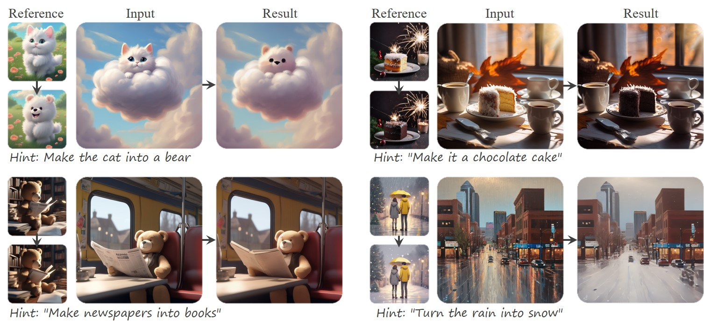

<!-- #  InstructBrush: Learning Attention-based Instruction Optimization for Image Editing -->
#  InstructBrush: Learning Attention-based Instruction Optimization for Image Editing

<!-- [](https://arxiv.org/abs/2311.14631) -->

<!--[[Project Website](https://royzhao926.github.io/CatVersion-page/)]-->

[](https://arxiv.org/abs/2403.18660)
[](https://royzhao926.github.io/InstructBrush/)
[](https://hits.seeyoufarm.com)
[](https://drive.google.com/file/d/1uhOA8r0yBwDXg0aUCdJsoY4smer0rOv_/view)

> Ruoyu Zhao<sup>1,2</sup>, Qingnan Fan<sup>2</sup>, Fei Kou<sup>2</sup>, Shuai Qin<sup>2</sup>, Hong Gu<sup>2</sup>, Wei Wu<sup>2,3</sup>, Pengcheng Xu<sup>2,4</sup>, 
> Mingrui Zhu<sup>1</sup>, Nannan Wang‡<sup>1</sup>, Xinbo Gao<sup>5</sup><br>
> 
> <sup>1</sup>Xidian University, <sup>2</sup>VIVO, <sup>3</sup>CityU, <sup>4</sup>Western University,
> <sup>5</sup>Chongqing University of Posts and Telecommunications


>**Abstract**: <br>
> In recent years, instruction-based image editing methods have garnered significant attention in image editing. However, despite encompassing a wide range of editing priors, these methods are helpless when handling editing tasks that are challenging to accurately describe through language. We propose InstructBrush, an inversion method for instruction-based image editing methods to bridge this gap. It extracts editing effects from exemplar image pairs as editing instructions, which are further applied for image editing. Two key techniques are introduced into InstructBrush, Attention-based Instruction Optimization and Transformation-oriented Instruction Initialization, to address the limitations of the previous method in terms of inversion effects and instruction generalization. To explore the ability of instruction inversion methods to guide image editing in open scenes, we establish a Transformation-Oriented Paired Benchmark (TOP-Bench), which contains a rich set of scenes and editing types. The creation of this benchmark paves the way for further exploration of instruction inversion. Quantitatively and qualitatively, our approach achieves superior performance in editing and is more semantically consistent with the target editing effects.


## Description
This is the official repository of the paper 
[InstructBrush: Learning Attention-based Instruction Optimization for Image Editing](https://arxiv.org/abs/2403.18660) 
<!-- 
## Updates 
`15/03/2024` Code released! 🐣🐣🐣

## Getting Started 🧨🧨🧨
### Preparation
* **Requirements**: InstructBrush have been tested on a GPU with >18GB VRAM. If your system does not meet the above condition, we recommend trying semi-precision training.
* **Environment**: Please reference *requirements.txt* or just run:
```
pip install -r requirements.txt
```


### Test 
Please run:
```
python test.py --log_dir path/to/log_dir --image_folder path/to/the/edited/image --device 0
```


### Train 

Please run:
```
python train.py --image_folder ./path/to/benchmark --subfolder dataset_name --device 0 --log_dir dir/to/save
```

For example:
```
python train.py --image_folder ./dataset --subfolder cloud_kitty --device 0 --log_dir log/cloud_kitty
``` -->


## Citation 
If you use this code or ideas from our paper, please cite our paper:
```
@article{zhao2024instructbrush,
            title={InstructBrush: Learning Attention-based Instruction Optimization for Image Editing},
            author={Zhao, Ruoyu and Fan, Qingnan and Kou, Fei and Qin, Shuai and Gu, Hong and Wu, Wei and Xu, Pengcheng and Zhu, Mingrui and Wang, Nannan and Gao, Xinbo},
            journal={arXiv preprint arXiv:2403.18660},
            year={2024}
            }
```

<!-- ## Acknowledgments
This code is based on [InstructPix2Pix](https://github.com/huggingface/diffusers/tree/main/examples/instruct_pix2pix), [Visii](https://github.com/thaoshibe/visii), [prompt-to-prompt](https://github.com/google/prompt-to-prompt), and [clip-interrogator](https://github.com/pharmapsychotic/clip-interrogator). Thanks to these open-source contributions! 👼 -->
